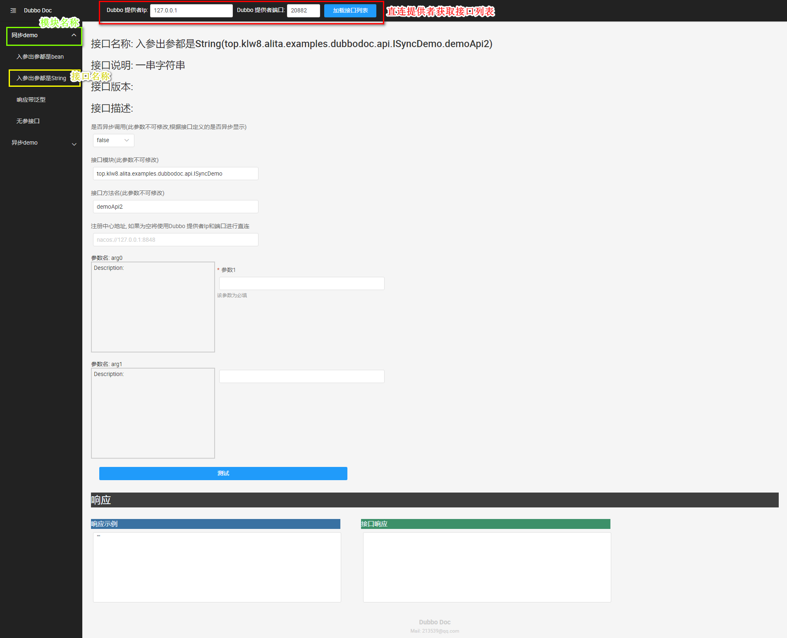

# dubboDoc

[English](./README.md)

dubbo 接口文档、测试工具,根据注解生成文档,并提供测试功能.

增加一些注解就能生成类似swagger的文档, 不会把非web的dubbo项目变为web项目.

## 版本规划
### 第一版
* 解析注解并生成界面
* 不太友好的使用界面(没有处理一些异常)
### 第二版
* 放json的文本域找一个合适的json编辑器替换,校验json格式
* 增加标签页
* 能保存测试,方便下次直接加载测试
* 部分异常处理为友好的文字提示
* 增加 apiRemark.md 并在前端展示
* 增加 apiChangelog.md 并在前端展示
### 后续版本
* 根据用户需求和issue规划
* 根据dubbo升级情况规划
## 注册中心支持
* 理论上dubbo支持的所有注册中心都支持

## 如何使用?
1. dubbo项目的方法参数中加上 dubbo api docs注解
   * dubbo提供者项目引入 dubbo-api-docs-core
   * 如果dubbo的接口和参数是一个单独的jar包项目,引入dubbo-api-docs-annotations
   
### 当前版本: 同Dubbo版本号
```
<dependency>
    <groupId>org.apache.dubbo</groupId>
    <artifactId>dubbo-api-docs-annotations</artifactId>
    <version>${dubbo-version}</version>
</dependency>

<dependency>
    <groupId>org.apache.dubbo</groupId>
    <artifactId>dubbo-api-docs-core</artifactId>
    <version>${dubbo-version}</version>
</dependency>
```
2.下载 dubbo-api-docs-ui-server [下载地址](https://github.com/apache/dubbo-spi-extensions/releases)

3. 启动 dubbo-api-docs-ui-server

4. 访问: http:// localhost:8888
   * application.yml 中可以修改端口
   * swagger-ui http:// localhost:8888/swagger-ui/
### 注解使用
* @ApiModule 类注解: dubbo接口模块信息,用于标注一个接口类模块的用途
    * value: 模块名称
    * apiInterface: 提供者实现的接口
    * version: 模块版本
* @ApiDoc 方法注解: dubbo 接口信息,用于标注一个接口的用途
    * value: 接口名称
    * description: 接口描述(可使用html标签)
    * version: 接口版本
    * responseClassDescription: 响应的数据的描述
* @RequestParam 类属性/方法参数注解:标注请求参数
    * value: 参数名
    * required: 是否必传参数
    * description: 参数描述
    * example: 参数示例
    * defaultValue: 参数默认值
    * allowableValues: 允许的值,设置该属性后界面上将对参数生成下拉列表
        * 注:使用该属性后将生成下拉选择框
        * boolean 类型的参数不用设置该属性,将默认生成 true/false 的下拉列表
        * 枚举类型的参数会自动生成下拉列表,如果不想开放全部的枚举值,可以单独设置此属性.
* @ResponseProperty 类属性注解: 标注响应参数
    * value: 参数名
    * example: 示例
### dubbo-api-docs-ui
* 获取接口列表直连: 由于可能不同功能的dubbo服务都会注册到同一个注册中心,但是dubbo doc
使用的接口名是一样的,所以dubbo doc的接口采用直连方式以获取到不同功能服务的不同接口列表
* 测试可以直连或者走注册中心

### 使用注意
* 响应bean(接口的返回类型)支持自定义泛型, 但只支持一个泛型占位符
* 关于Map的使用:Map的key只能用基本数据类型.如果Map的key不是基础数据类型,生成的
就不是标准json格式,会出异常
* 接口的同步/异步取自 org.apache.dubbo.config.annotation.Service.async

## 项目结构
* dubbo-api-docs-annotations: 文档生成辅助注解项目
* dubbo-api-docs-core: 负责注解解析,文档信息获取接口(dubbo接口)
* dubbo-api-docs-ui-server: web服务,负责展示doc,并提供测试功能
* dubbo-api-docs-ui: 前端项目, 发布时会打包到 dubbo-doc-ui-server 项目中
* dubbo-api-docs-examples: 使用示例
* readmeImgs: README.md 用到的图片

## 主要依赖版本
* spring-boot: 2.3.4.RELEASE
* dubbo: apache dubbo 2.7.8
* 前端使用飞冰(iceworks 4.0)

